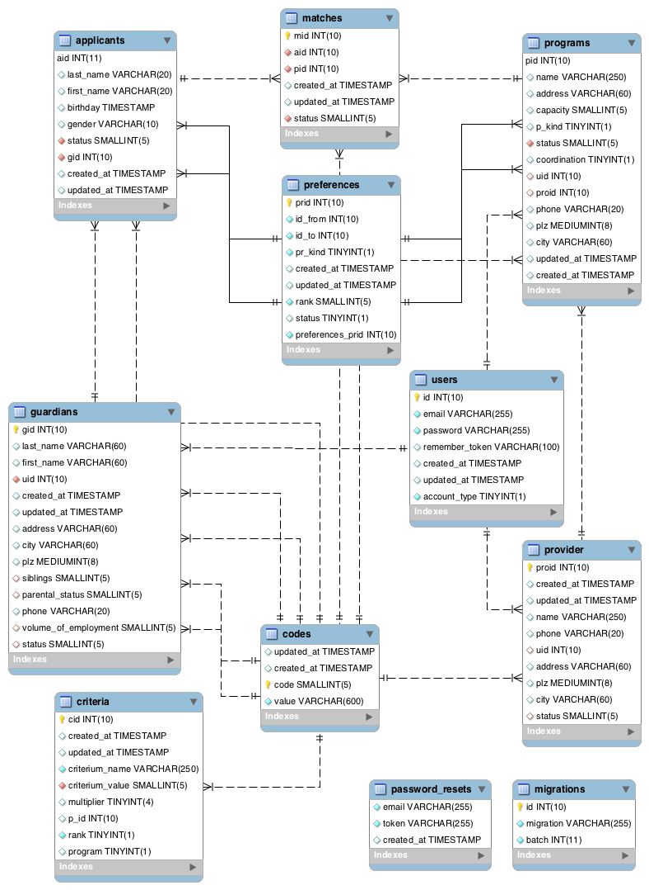

# KitaMatch - Database Manual

*Deprecated!*

## EER Diagram

## Program
Program class handles public and private programs.
### Codes
#### p_kind
* 1: Public
* 2: Private
#### Status
* 10: not valid / no information
* 11: created, but not proofed; no participation
* 12: valid; participates
* 13: did not send offers for at least seven days; no participation

## Applicant
Applicant class handles the applicants and their information, here children.
### Codes
#### Status
* 20: not valid (either no preferences or valid documents)
* 21: created, but not proofed; no participation
* 22: valid; participates
* 25: priority
* 26: finished matching

## Matching
Matching class mainly handles the API calls.
### Codes
#### Status
* 30: no match
* 31: current match
* 32: final match
* 33: historical match

## Preferences
Preference class maintains preferences in two-directions, from applicant to program and from program to applicant.
### Codes
#### pr_kind
* 0: aplicant's feasible set of childcare institutions
* 1: applicant to program
* 2: coordinated program to applicant
* 3: uncoordinated program to applicant
#### Status Codes
* -2: manually deleted
* -1: historic (preference not reciprocated)
* 0: not valid
* 1: valid

## Guardians
Guardians maintain the social master data required for the coordination and hols
### Codes
#### Status
* 50: not valid (either no preferences or valid documents)
* 51: created, but not proofed; no participation
* 52: valid

## Providers
### Codes
#### Status
* 60: not valid
* 61: valid

## Criteria
### Codes
#### parental_status
* 0:  Neutral
* 820: Hoch (Eine/Ein Alleinerziehende/r beschäftigt)
* 821: Mittel (Beide Erziehungsberechtigte beschäftigt
* 822: Niedrig (Ein Erziehungsberechtigter beschäftigt)

#### volume_of_employment
* 0:  Neutral
* 830: Hoch (Ganztags, ab 28 h/Woche)
* 831: Mittel (Halbtags, ab 16-27 h/Woche)
* 832: Niedrig (Geringfügig, ab 8-15 h/Woche)

#### siblings
* 0:  Neutral
* 840: Kein Geschwisterkind (Nein)
* 841: Geschwisterkind (Ja)
* Manual Points: Provider-Id of the sibling

#### religion
* 0:  Neutral
* 850: Konfessionslos
* 851: Katholisch
* 852: Evangelisch
* 853: Muslimisch
* 854: Jüdisch
* 855: Andere

#### change_request
* 860: Ja
* 861: Nein

## User
### Codes
#### account_type
* 1: Guardian
* 2: public Program
* 3: private Program
* 4: Provider
* 5: Admin (no entry at the moment, implemented in code)
